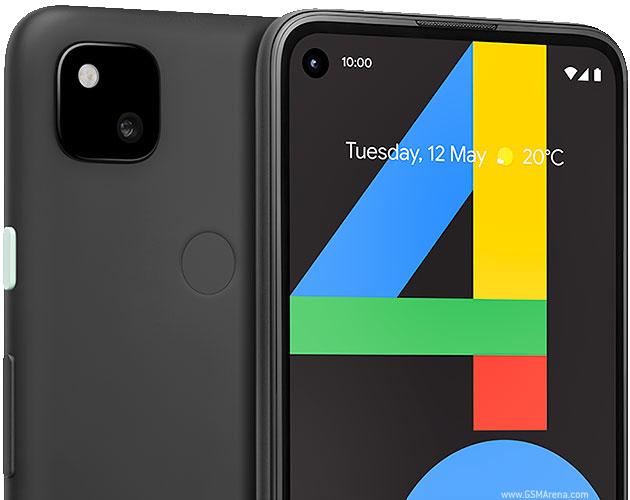

# Device configuration for the Google Pixel 4a (sunfish)

## Specs:
| Feature | Specification | 
| :--- | :--- |
| **CPU** | Snapdragon 730G |
| **GPU** | Adreno 618 |
| **Battery** | 3140 mAh Li-Po |
| **Storage / RAM** | 128GB / 6GB|
| **Display** | 1080 x 2340 OLED (~443 ppi) |
| **Dimensions** | 144 x 69.4 x 8.2 mm |
| **Ship Android** | Android 10 |
| **Latest Official** | Android 13 (EOL) |
## Working stuff:
| Feature | Works/Not  | 
| :--- | :--- |
| **Brightness** | ✅ |
| **Wifi** | ✅ |
| **Bluetooth** | ✅ |
| **Cameras** | ✅ |
| **AOD** | ✅ |

